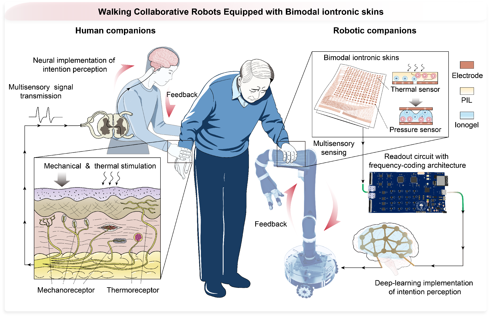
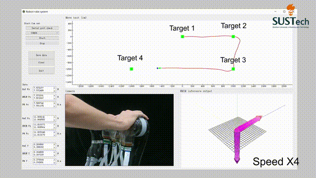

# Large-scale iontronic skins with neural-hierarchical processing architecture

 
 

 
 
 

 
 
 

 

 
 

 

## Project introduction:

Welcome to the **NI-skins** repository, a cutting-edge project that introduces a large-scale, neural-hierarchical iontronic skin (NI-skin) for robotic applications. Our system emulates the hierarchical processing architecture of the human tactile sensory system, offering ultra-high spatial and temporal resolution for fine tactile perception in robots. 

This novel skin technology integrates over 10,000 sensing units and enables the robot to perform tasks with remarkable precision, such as dexterous manipulation of delicate objects and proactive injury avoidance through nociceptive sensing. The NI-skin system uses position-encoded frequency-modulation for parallel signal transmission, minimizing latency and signal crosstalk while maintaining high spatiotemporal resolution (800 µm and 10.6 ms).

## Key Features:
- **Neural-Hierarchical Architecture**: Mimicking the human sensory system with receptor, spinal, and cognitive layers for efficient tactile data processing.
- **High Spatial & Temporal Resolution**: Achieves 800 µm spatial and 10.6 ms temporal resolution, enabling detailed touch interaction.
- **Low Latency & Crosstalk Suppression**: Utilizes frequency encoding and a crosstalk suppression mechanism for real-time, high-density tactile sensing.
- **Pain Perception and Self-Protection**: Enables robots to detect sharp stimuli and trigger protective reflexes, mimicking human-like pain response.
- **Scalable Integration**: Easily scalable to large robotic surfaces, offering flexibility in design and implementation.

As our project is an interdisciplinary endeavor integrating material design, hardware development, and software engineering, you may find the code somewhat chaotic. We are actively working to improve its organization and documentation. If you have any suggestions or specific requirements, please feel free to reach out—we would be delighted to further improve the project based on your feedback.

## Description:
This repository contains resources related to **large-scale tactile perception based on NI-skins**, including **hardware design, signal processing and algorithm implementations, as well as robotic experimental validation code**.

- **Hardware Design**  
  This module contains the firmware for the encoding–decoding interface of the sensor array. The accompanying PDF files provide detailed documentation of the hardware components and circuit schematics.

- **Graphical User Interface (GUI)**  
  The GUI is a high-level interface developed in Python using libraries such as PyQt5, PyQtGraph, and OpenCV. It is designed for sensor debugging, experimental data acquisition, and analysis. The software provides a user-friendly graphical interface that enables real-time interaction with the sensor array, facilitating immediate data visualization and supporting downstream application research.

- **Deep Learning Framework**  
  This module is a PyTorch-based neural network framework for cognitive analysis and recognition of large-scale tactile data. It includes comparative configurations under different compression levels, as well as a three-dimensional convolutional neural network (3D-CNN) for spatiotemporal feature extraction. In addition, a pain regression model based on large-scale tactile signals is provided.

- **Dexterous Hand Control Scripts**  
  This module contains Python demo scripts for real-time sensor data reception and inference, enabling closed-loop tactile feedback control of a dexterous robotic hand.

## Platform:
### The code is intended to run on the following platform:
-Windows

### Fabrication of the NI-skin
NI-skin consisted of two components: a microstructured ionogel with a TPU encapsulation layer and an electrode array. These two parts were assembled directly using commercially available double-sided tape. The ionogel precursor was composed of 2.7345 g (15 mmol) of 3,6-Dioxa-1,8-octanedithiol, 2.9862 g (21 mmol) of 1,4-Butanediol divinyl ether, 1.5942 g (4 mmol) of 1,1,1-Tris(3-mercaptopropionyloxymethyl)propane, 0.036 g (0.5 wt% relative to total monomer) of photoinitiator 2,2-Dimethoxy-2-phenylacetophenone, and 0.5852 g (8 wt% relative to total monomer) of 1-Ethyl-3-methylimidazolium bis(trifluoromethylsulfonyl)imide. All components were thoroughly mixed and oscillated until a clear homogeneous solution was obtained. The electrode array was manufactured using flexible printed circuit (FPC) processing technology and was outsourced to Shenzhen Jialichuang Technology Group Co., Ltd.

### Development of interface circuitry for NI-skin
The direct digital frequency synthesizers (DDS, AD9833, Analog Devices Instruments) were used to generate frequency-tunable AC excitation signals. The backend circuit consisted of a high-pass filter with a cutoff frequency of 200 Hz and a voltage follower implemented using an operational amplifier (OPA4388, Texas Instruments). The design of the decoding circuit and computation block are shown in Fig. S7. The C/V converters were implemented with a precision operational amplifier (OPA4388, Texas Instruments), in which the reference resistor was implemented using a programmable digital potentiometer (TPL0501-100) to enable adaptive adjustment of the output conversion voltage. The 16-bit analog-to-digital converters (ADC, AD7606, Analog Devices Instruments) were employed to acquire voltage signals from the analog front-end. Each ADC chip provides eight synchronous voltage-sampling channels. The sampling rate was set at 50 kSPS, and the data were read out via a parallel SPI bus. An FPGA (Altera EP4CE6F17C8N) was deployed for parallel acquisition from multiple ADCs and subsequent parallel FFT demodulation. The FPGA processes multi-channel ADC parallel sampling and performs parallel FFT demodulation using DSP blocks to extract the frequency-encoded sensory response. The demodulated signals are then aggregated and compressed. The compressed data is transmitted to the central processor via USB or Ethernet as the main data bus.

### Demonstration setup
For the tactile perception task of dexterous grasping, an NI-skin (48×48 elements in 7cm×7cm) was mounted on a commercial dexterous hand (RH56BFX) to record sensing signals when grasping various everyday objects. For the large-area tactile sensing task on a robotic body, an NI-skin (96×96 elements in 15 cm×15 cm) was attached to the outer surface of a humanoid robot model to perceive and record tactile responses under different contact objects and gestures. For the fingertip fine-perception and nociception tasks, a high-density NI-skin  (156 elements cm^(-2))  was mounted on the soft finger of a robotic gripper, which was installed on a commercial robotic arm (Universal Robot 10e). Tactile signals were transmitted via a data bus using the USB/TCP protocol to a laptop computer serving as the central processor, which in turn controlled the robotic arm (or gripper) motion through TCP/IP communication. The interactive user software for the host computer was developed using Python 3.9 with the PyQt5, PyQtGraph, and OpenCV frameworks. It supported real-time data transmission, waveform visualization, graphical rendering, tactile map visualization, and data storage.

### IDE:
We recommend using the following integrated development environments (IDEs) to work with this code:

- STM32CubeMX
- STM32CubeIDE
- Keil5
- Quartus II
- Visual Studio Code

Please download all data & codes and then unzip all the folders and place them in the same folder. 

### Construction of dataset
Grasping Dataset: this dataset recorded tactile pressure data from the robotic hand’s NI-skin during the grasping of 10 object categories, with each object grasped 4 times. Data was collected at 94 Hz, with a grasp duration of 3-5 s, covering tactile responses from 10 daily items.

Touch Dataset: This dataset captured dynamic pressure data from 10 different touch gestures applied to the large-area NI-skin on the robotic body. Each gesture lasted 3-10 s and was performed by four subjects, with data being recorded at 94 Hz. 

Pain-perception Dataset: This dataset recorded tactile responses from the NI-skins on robotic fingers under 5 different sharpness levels (controlled by a power-law index), defined as varying pain degree (0-100%). Data was collected at 94 Hz under a constant force of ~500 mN, with each pain level being recorded for 3-5 seconds.

***
Finally, if you have any feedback or suggestions regarding our code and dataset, please let us know—we would love to hear from you. If you encounter any issues during code implementation, feel free to contact us at 12231066@mail.sustech.edu.cn.
